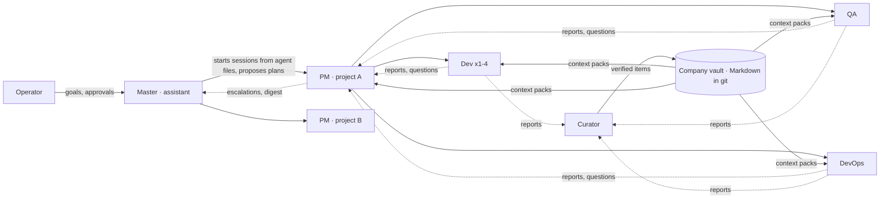

# Plan — MVP first: an agent team you can hand work to, then one that learns

Date: 2026-09-23. Status: direction accepted by the operator ("go", 2026-09-23);
individual designs stay proposals until their ADR or ticket lands. Readable
source of the Plan tab in [index.html](index.html). Companion records:
[ROADMAP.md](ROADMAP.md) (milestones and tickets), [RESEARCH.md](RESEARCH.md)
(state of the art), [DIRECTION.md](DIRECTION.md) (market and go-to-market),
[TECHNICAL.md](TECHNICAL.md) (install, identity, platforms, sandbox),
[PROVENANCE.md](PROVENANCE.md) (decision ledger). Architecture records:
[agent filesystem](../../docs/design/AGENT-FILESYSTEM.md) and
[learning loop](../../docs/design/LEARNING-LOOP.md).

## Summary

**MVP first, then refine** (operator, 2026-09-23). The MVP makes one journey work
end to end: install → connect the agents you already use → point at a repo → ask
for work in chat → approve a plan → agents implement and independently review it →
you answer questions and merge → you come back later and see what happened.
Memory and learning, platforms, many-project scale and autonomy come after, on the
same building blocks.

## MVP — use cases and UX

| # | Use case | What the user does | What they see (UX) | Tickets |
|---|---|---|---|---|
| 1 | Install | Runs one command (or pastes the agent prompt) | Terminal prints checks and a login link; browser opens | CAD-311, CAD-312, CAD-313 |
| 2 | Set up | Confirms detected CLIs, picks the master (Claude or Codex), points at a repo | One setup page: checklist, master picker, repo path — nothing else | CAD-327, CAD-358, CAD-338 |
| 3 | Ask for work | Types a goal in chat | Master replies in a thread; a **plan card** lists tickets with acceptance | CAD-319, CAD-320, CAD-328, CAD-339, CAD-359 |
| 4 | Approve | Clicks Approve (or asks for changes) | Plan becomes an epic with a progress bar; work starts | CAD-360, CAD-405 |
| 5 | Watch work | Nothing — or opens the project | Epic progress and stage, each ticket's status, which agent holds it | CAD-361, CAD-325, CAD-326 |
| 6 | Answer | Clicks an answer on a question or permission card | One **Needs you** list: questions, permissions, merges — each a card with options | CAD-341, CAD-363, CAD-323 |
| 7 | Review & merge | Clicks Merge after an independent PASS | Card shows reviewer, verdict pinned to the commit, CI state | CAD-362, CAD-363 |
| 8 | Come back | Opens the browser next day | "Since you left" summary; the chat and project state are intact; sessions resume | CAD-324 |

**MVP exit test:** on a clean Linux box, a new user installs, connects Claude or
Codex, points at a repo, asks for a small feature, approves the plan, watches 2–3
tickets implemented and reviewed by a different agent, answers one question,
merges, closes the browser and returns to an accurate summary — without reading
docs or touching a terminal after install.

**MVP screens:** Setup · Home (chat + Needs you + since-you-left) · Project (epic
progress + board) · Agents (who is doing what, minimal). Vault, Platforms and
Settings beyond the master/repo choice are **not** in the MVP.

**MVP tickets:** tracker tag `mvp` (M0 remainder + selected M1 and M2).
Safety stays in: sandbox and backups (M0), operator auth, the gate, fresh-context
review, secret scanning.

**After the MVP, in order of evidence:**
1. **Refine 1 — Learn:** reports → verified memory → context packs, vault
   (today's M3; CAD-381 already merged, CAD-382 parked).
2. **Refine 2 — Reach:** macOS, clean-machine CI, Pi adapter, many projects (M4).
3. **Refine 3 — Ship:** connected platforms and effects (M5).
4. **Refine 4 — Autonomy:** the dial after CAD-225 (M6).

## 0. Pragmatic core — build little, generically

Principle (operator, 2026-09-23): add only what is necessary, and make it generic
enough to extend. Everything in this plan reduces to **five building blocks**; the
rest is configuration on top of them or is explicitly *later*.

| Block | What it is | How it extends |
|---|---|---|
| **Files** | Markdown + frontmatter in one git home, written by one writer | A new concept is a new folder + schema |
| **Agents & sessions** | `agents/<slug>/` definition + running sessions, behind the existing provider adapter | A new provider is an adapter; a new agent is a folder |
| **Records** | One `report` (done / question / blocked) and one `decision` | A new kind is a frontmatter value, not a subsystem |
| **Gate** | One policy check: action × actor × evidence → allow / ask / refuse | Plan approval, dispatch, merge, effects, memory acceptance and the autonomy dial are rows in one table |
| **Pack** | One context builder: agent + task → bundle | A new knowledge source is one selector |

**MVP uses four of the five blocks** — files, agents & sessions, records, gate. The
pack stays minimal (contract + continuity) until Refine 1 adds verified memory.

**Work model** (CAD-405, [record](../../docs/design/WORK-MODEL.md)): explicit epic/task types,
epic stages with exit criteria, computed size-weighted progress and health,
milestones in `PROJECT.md` — all on the same issue files and gate.

**Folded, not built separately:** cross-vendor QA/curator rules are gate rows
(CAD-340 → CAD-360); question routing is a report + decision (CAD-342 → CAD-341,
CAD-363); the verification queue is decision cards in Needs-you (CAD-357 later).

**Later, only when evidence asks for it:** write leases (CAD-378), Pi adapter
(CAD-322), nightly consolidation, skills promotion, learning dashboard, notes and
code maps, dedicated Vault UI, home-directory migration (CAD-392), decision-model
pilot (CAD-394), many projects (M4), platforms (M5), autonomy dial (M6).

## 1. Organization



- **Responsibility flows down.** The master proposes a project plan and its
  staffing (agents × sessions); the operator approves. The PM owns the plan and dispatches inside it. One
  writer per code area; research and review run in parallel.
- **Reports flow up.** Every job, question or blocker files a typed report: the
  six-field reflection, evidence, constraints copied verbatim, and feedback on
  the context it was given.
- **Questions climb, then stop.** Worker → PM → master → operator. The vault is
  checked first; a question stops at the first level that can answer it, and the
  answer becomes a decision nobody asks twice.

## 2. How the team learns

| Step | What happens | Precedent |
|---|---|---|
| 1 Report | Typed claims (fact, strategy, pitfall, procedure, question) with evidence: `file:line@SHA`, command + exit code, test id | ReasoningBank, SWE-Exp, MAST |
| 2 Checks | Resolve citations at HEAD, re-run cited tests in a build slot, secret scan, de-duplicate, detect contradictions, tag external-derived content | Copilot Memory; DGM's faked logs |
| 3 Curator | A different vendor from the proposer: ADD / UPDATE / INVALIDATE / NOOP / ESCALATE | ACE, Mem0, self-preference study |
| 4 Vault | One Markdown item per file in git with scope, evidence, provenance, validity and counters; contradictions invalidate, nothing is silently deleted | Zep, Letta |
| 5 Pack | At session start: SOUL + AGENT + MEMORY index, contract, top cited items "verified at SHA" — re-checked at build, stale items withheld with a reason | Copilot Memory, Claude Code memory, Agent Skills |
| 6 Feedback | The next report marks items used, helpful or wrong and lists files it still re-read; harmful items demote; unused items expire after 28 days | ACE counters, Copilot Memory |
| 7 Consolidation | Nightly, the curator proposes a vault change as a reviewed diff — never an in-place rewrite | Managed Agents Dreams |
| 8 Measure | A/B with and without packs on matched tasks: reuse, helpful/harm, stale rate, reads avoided, tokens, time, merges without rework | Copilot A/B, VibeMemBench |

Details and the trust matrix: [learning loop](../../docs/design/LEARNING-LOOP.md).

## 3. Agents are folders of Markdown

Decision #1 (operator, 2026-09-23): the system is a filesystem, and all
information is Markdown. There is no separate role layer: an **agent** is the
definition and runs as many **sessions** as needed; all sessions share its soul,
contract and memory.

```text
~/pm/
  agents/<slug>/       SOUL.md  AGENT.md  MEMORY.md  memory/  journal/
  projects/<slug>/     PROJECT.md  shared/  memory/  tickets/<ID>/   # PROJECT.md: agents × sessions
  company/  lessons/  decisions/  faq/  inbox/
```

Full design, file contracts and who may write what:
[agent filesystem](../../docs/design/AGENT-FILESYSTEM.md).

| Agent | Mandate | Preferred | Fallback | Sessions |
|---|---|---|---|---|
| Master · assistant | Talks with the operator; creates teams and plans; routes questions; daily digest. Never implements. | claude · opus · high | codex · gpt-5.5 · high | 1 per install |
| PM | Owns one team's plan; testable acceptance before code; dispatches inside the plan; collects reports | codex · gpt-5.5 · medium | claude · sonnet · medium | 1 per team |
| Developer | One issue, own worktree, tests, PR with SHA, report | codex · gpt-5.5-codex · high | claude · sonnet · high | 1–4 per team |
| QA reviewer | Fresh-context review of the exact commit against the contract; verdict pinned to SHA | claude · opus · high | codex · gpt-5.5 · high | 1 per team |
| DevOps | Merge queue with PASS on head; deploys and sends as effects; host health | claude · sonnet · medium | pi · glm-5.3-flash · low | 1 per team |
| Researcher | Spikes, specs, ADR drafts with sources | claude · opus · high | codex · gpt-5.5 · high | on demand |
| Curator | Verifies candidates, merges duplicates, retires stale items, drafts skills | codex · gpt-5.5 · medium | claude · sonnet · medium | 1 per company |

Defaults are illustrative; model names follow each CLI's aliases.

## 4. Operating rules (enforced by the daemon, not the prompt)

- **Contract first.** The PM writes testable acceptance before code; QA verifies
  against the contract, never the author's summary.
- **Independent review.** Fresh context always; a different vendor by default,
  with pairings chosen by measured review precision.
- **One writer per code area.** Path-scoped write leases; parallel work is reads.
- **Separation of duties.** No agent reviews, merges or accepts its own work or
  lessons, edits its own `AGENT.md`, or treats another agent's message as consent.
- **Evidence over self-report.** "Done" is a claim until a verdict pins it to a
  commit; "tests passed" is re-run before a lesson is accepted.
- **Lean context.** No repo overviews in packs; short instruction files;
  byte-stable prefixes; fresh sessions over stale revivals.

## 5. Milestones

| Milestone | Outcome | Exit test |
|---|---|---|
| M0 Safe foundation | Sandbox, real backups, event roll-up | Backup → restore round-trip in a sandbox; production untouched |
| M1 First conversation | Install → wizard → chat with a master that remembers | Clean box to chat in < 5 min; kill the session mid-plan → it resumes |
| M2 One governed project | Master → one project staffed from agent files; plans, gate, reviews, reports | A 3-issue plan lands with fresh-context verdicts, typed reports, and a question answered at the lowest level |
| M3 The team learns | Verified memory, Markdown vault, packs, metrics | A lesson from one worker is verified by another vendor and reused by a different worker with measured savings; a stale item is withheld; a planted poisoned item is rejected |
| M4 Many projects | Several projects under one master | Two projects run concurrently with no cross-project leakage |
| M5 Ships | Connected platforms and effects | Preview deploys auto; production and sends only on the operator's press |
| M6 Autonomy dial | Routine merges automatic per project | Only after CAD-225 passes |
| GTM | Partners after M1 · beta after M3 · GA after M5 | Legal review of provider terms before beta |

Tickets per milestone: [ROADMAP.md](ROADMAP.md).

## 6. Decisions

| # | Topic | Decision | Status |
|---|---|---|---|
| 1 | Agent definitions | Filesystem, all Markdown: `agents/<slug>/SOUL.md`, `AGENT.md`, `MEMORY.md`; no role layer — an agent runs many sessions; no teams for now — staffing in `PROJECT.md`; project artifacts under `projects/<slug>/` (CAD-338, answers CAD-116) | operator direction 2026-09-23; design record proposed |
| 2 | Memory policy | Logic checks + cross-vendor curator for project/role scope; two-review quorum for company scope; external content quarantined (CAD-347) | approved 2026-09-23 |
| 3 | Unblocking memory | Separate *who proposed* from *is it true*: one daemon identity check for every launched agent (CAD-381); trust matrix provenance × evidence; the 11 stuck lessons move through checks → curator → operator queue (CAD-382) | confirmed 2026-09-23 |
| — | Organization | One master; a PM session per project; dev, QA, DevOps sessions; curator at company level; no teams for now | operator direction |
| — | Autonomy | Plan freely, ask to dispatch; operator merges and presses effects | decided |
| — | Master providers | Structured (Claude, Codex, Pi); unmodified official binaries only | decided |
| — | Platforms | Contract-first; Cloudflare own account first; AgenticOS v2 via AOS-49 | decided |

## 7. What we will not do

- Run a hosted Cadence service — hosting is AgenticOS's job (AOS-34).
- Run an always-on all-agent chat, or peer swarms without an owner.
- Inject unverified memory, or promote anything derived from external content
  without the operator.
- Let any agent grade, merge or accept its own work, edit its own `AGENT.md`,
  see a credential, or press an effect.
- Turn on auto-merge before the unattended acceptance check passes.
