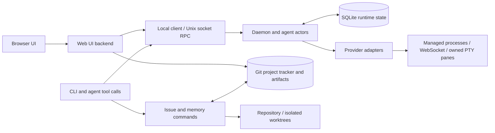

# Cadence architecture and code map

Source baseline: `ceee1cf` (2026-09-21). This describes the current module
boundaries; future product behavior is in the [design proposal](design/DEVELOPMENT-TEAM.md).
Start with [project context](START-HERE.md) for scope and role-specific reading.

## System boundaries

The diagram is a responsibility map, not a claim that every CLI verb traverses
all these nodes. Some reads operate directly on tracker files; runtime actions
use the daemon. The board serves typed observations and task/project views.

Three storage concerns stay distinct:

- **Runtime SQLite:** agent/session identity, messages/events, job/task state,
  verdicts and monitor state. Delivery and lifecycle must reconcile across
  restarts; exact details are in [protocol](PROTOCOL.md) and [jobs](JOBS.md).
- **Git tracker:** project registration, issue files, comments, evidence refs
  and project memories. See [board](BOARD.md) for layout, writer and derived
  status rules. It is separate from the product source repository by default.
- **Product repository/worktrees:** code, versioned design/ADRs, tests and build
  artifacts. A tracker reference binds work to the real repo/branch/worktree;
  folder names alone are not ownership proof.

## Code ownership map

| Path | Responsibility / first read |
|---|---|
| `src/main.rs` | CLI definitions, command routing, launch/briefing composition. |
| `src/client.rs`, `src/proto.rs` | Local RPC client and protocol vocabulary. |
| `src/daemon.rs` | Agent actors, lifecycle/reconciliation, RPC dispatch and runtime coordination. |
| `src/store.rs` | SQLite schema/migrations and durable message, task, verdict and monitor transitions. |
| `src/adapter/mod.rs`, `registry.rs` | Common adapter types and provider capability descriptors. |
| `src/adapter/codex.rs`, `claude.rs`, `ws.rs`, `stdio.rs` | Structured provider execution and transport support; check the registry for accepted combinations. |
| `src/adapter/pty/` | Owned terminal lifecycle, profile-specific screen interpretation, delivery and rendering evidence. Text classification is not authoritative provider approval. |
| `src/issue/` | Project/issue files, start/dispatch/finish, history, report intake, relay and read-only retros. |
| `src/memory/` | Proposal/curation CLI, scoped matching, bounded rendering and staleness observations. |
| `src/review.rs`, `src/audit.rs` | Revision-bound review execution/evidence and merge/audit reconstruction. |
| `src/slots.rs`, `src/doctor/host.rs` | Build/test admission and host/session ownership/resource observations. |
| `src/session.rs`, `src/worktree.rs`, `src/proc.rs` | Session/worktree operations and process helpers. |
| `src/ui.rs`, `src/overview.rs` | HTTP/API surface and aggregated project/agent/actionable observations. |
| `ui/src/components/`, `ui/src/types.ts`, `ui/src/api.ts` | React views, frontend types and API access. |
| `tests/` | Integration/board fixtures and the partial unattended-team acceptance harness. |
| `scripts/`, `.config/nextest.toml`, `.github/workflows/` | Review receipts, pinned test tooling and CI. |
| `docs/adr/`, `docs/roles/`, `docs/design/` | Decision history, role/policy documents and labelled product design proposals. |

## Work and evidence flow

A task has an objective and acceptance; its delivery message carries correlated
identity and revision evidence. Per-agent execution, durable task state and
provider/pane observations are different axes. An inbox endpoint stores
messages but has no worker actor. External collaboration agents are not
implicitly members of the native Cadence registry.

Implementation results go to independent review. A verdict names the reviewed
commit; changing the head invalidates its applicability. Combined-tree checks
address changes that landed in main after review. Recording merge evidence is
different from executing a GitHub merge. Source merge is different from a live
binary rollout and database migration.

Resource admission and provider quota are also different. A free build slot does
not prove provider allowance, and attaching/detaching a terminal does not prove
its provider process ended. Reclamation must prove ownership at action time.

## Memory implementation boundaries

`src/issue/dispatch.rs` matches accepted project memories, writes a bounded
lessons file and records included IDs. `src/main.rs` adds accepted project-wide
rules to generated briefings. The generic job/coordinator path must be checked
separately; do not assume all entry points share this retrieval behavior.

The current memory schema records proposer, source, confidence and verification
time, but still needs stronger authenticated curator identity and independent
acceptance evidence. Path-only matching depends on recorded commit paths, so
new work without commits can miss a relevant lesson. Proposed improvements are
in the [learning design](design/DEVELOPMENT-TEAM.md).

## Validation and change impact

Use current repository instructions for the exact commands and admission rules.
After shared model changes, compile all Cargo targets: selected behavioral tests
can miss an uncompilable unit-test initializer. Keep fixtures isolated from
ambient environment and credentials. The pinned runner rejects empty selections;
record exact test counts and source/tree identity. Use the host suite lock and
bounded build concurrency, and verify the running daemon supports an admission
RPC before instructing workers to use it.

A generated graph can suggest affected modules, but review the actual diff and
contract. It cannot establish semantic correctness, reviewed authority, resource
ownership or a feature's deployed state.
