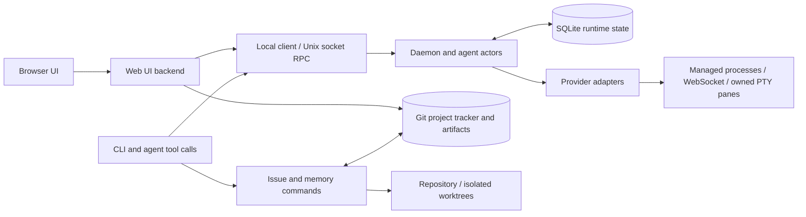

# Cadence architecture and code map

Code map updated 2026-09-26. This describes the source module
boundaries; future product behavior is in the [design proposal](design/DEVELOPMENT-TEAM.md).
Start with [project context](START-HERE.md) for scope and role-specific reading.

## System boundaries

The diagram is a responsibility map, not a claim that every CLI verb traverses
all these nodes. Some reads operate directly on tracker files; runtime actions
use the daemon. The board serves typed observations and task/project views.

Three storage concerns stay distinct:

- **Runtime SQLite:** agent/session identity, messages/events, job/task state,
  verdicts and monitor state. Delivery and lifecycle must reconcile across
  restarts; inspect the [RPC vocabulary](../src/proto.rs),
  [job handlers](../src/daemon/jobs_rpc.rs) and [storage](../src/store/mod.rs)
  for the contract at your source revision.
- **Git tracker:** project registration, issue files, comments, evidence refs
  and project memories. See [board](BOARD.md) for layout, writer and derived
  status rules. It is separate from the product source repository by default.
- **Product repository/worktrees:** code, versioned design/ADRs, tests and build
  artifacts. A tracker reference binds work to the real repo/branch/worktree;
  folder names alone are not ownership proof.

## Code ownership map

| Path | Responsibility / first read |
|---|---|
| [src/main.rs](../src/main.rs) | Binary entry point, process error/exit handling; delegates commands to CLI. |
| [src/cli/mod.rs](../src/cli/mod.rs), [src/cli/](../src/cli/) | CLI definitions, routing and launch composition; command behavior split into verb modules. |
| [src/cli/briefing.rs](../src/cli/briefing.rs) | Briefing modes, document and cloud bootstrap rendering, role carry-forward and opt-in AGENTS.md block. |
| [src/client.rs](../src/client.rs), [src/proto.rs](../src/proto.rs) | Local RPC client and protocol vocabulary. |
| [src/daemon.rs](../src/daemon.rs), [src/daemon/](../src/daemon/) | Shared runtime coordination and central dispatch; area RPC handlers, identity, timers and actor lifecycle. |
| [src/store/mod.rs](../src/store/mod.rs), [src/store/schema.rs](../src/store/schema.rs), [src/store/](../src/store/) | SQLite schema/migrations and durable transitions, partitioned by domain; store tests live under `src/store/tests/`. |
| [src/backup/](../src/backup/) | Online-backup manifests, secret-scanned exports, restore with repository remap. |
| [src/adapter/mod.rs](../src/adapter/mod.rs), [src/adapter/registry.rs](../src/adapter/registry.rs) | Common adapter types and provider capability descriptors. |
| [src/adapter/](../src/adapter/), [src/adapter/pty/](../src/adapter/pty/) | Structured provider transports and owned terminal lifecycle. Check the registry for accepted combinations; screen classification is not provider approval. |
| [src/issue/](../src/issue/) | Project/issue files, start/dispatch/finish, history, report intake, relay and read-only retros. |
| [src/memory/](../src/memory/) | Proposal/curation CLI, scoped matching, bounded rendering and staleness observations. |
| [src/review.rs](../src/review.rs), [src/audit.rs](../src/audit.rs) | Revision-bound review evidence and merge/audit reconstruction. |
| [src/slots.rs](../src/slots.rs), [src/doctor/host/mod.rs](../src/doctor/host/mod.rs), [src/doctor/host/](../src/doctor/host/) | Build/test admission and partitioned host/session ownership/resource checks. |
| [src/session.rs](../src/session.rs), [src/worktree.rs](../src/worktree.rs), [src/proc.rs](../src/proc.rs) | Session/worktree operations and process helpers. |
| [src/ui.rs](../src/ui.rs), [src/overview.rs](../src/overview.rs) | HTTP/API surface and aggregated project/agent/actionable observations. |
| [ui/src/features/](../ui/src/features/), [ui/src/lib/](../ui/src/lib/), [ui/src/ui/](../ui/src/ui/) | React feature screens, shared frontend libraries and UI primitives. |
| [tests/](../tests/), [tests/common/](../tests/common/), [tests/board_common/](../tests/board_common/) | Per-area integration suites, daemon/board fixtures and the partial unattended-team acceptance harness. |
| [scripts/](../scripts/), [.config/nextest.toml](../.config/nextest.toml), [.github/workflows/](../.github/workflows/) | Review receipts, pinned test tooling and CI. |
| [docs/cadence/project-context.yaml](cadence/project-context.yaml), [docs/design/](design/), [docs/roles/](roles/) | Tracked context manifest, labelled design proposal and risk policy. Additional local working documents are not shipped contracts. |

## Work and evidence flow

A task has an objective and acceptance; its delivery message carries correlated
identity and revision evidence. Per-agent execution, durable task state and
provider/pane observations are different axes. An inbox endpoint stores
messages but has no worker actor. External collaboration agents are not
implicitly members of the native Cadence registry.

Implementation results go to independent review. A verdict names the reviewed
commit; changing the head invalidates its applicability. Combined-tree checks
address changes that landed in main after review. Recording merge evidence is
different from executing a GitHub merge. Source merge is different from a live
binary rollout and database migration.

Resource admission and provider quota are also different. A free build slot does
not prove provider allowance, and attaching/detaching a terminal does not prove
its provider process ended. Reclamation must prove ownership at action time.

## Memory implementation boundaries

`src/issue/dispatch.rs` matches accepted project memories, writes a bounded
lessons file and records included and withheld IDs. `src/cli/briefing.rs` adds accepted
project-wide rules to generated briefings. `--job` kickoffs are
daemon-templated and carry no lessons (CAD-194); do not assume every entry point
shares this retrieval behavior.

A memory record carries the daemon-authenticated proposer proof, one receipt
per independent reviewer (identity, digest, evidence) and PM finalization
receipts; `src/memory/mod.rs` refuses retrieval without two non-author passes
and a matching PM finalization; see the [memory implementation](../src/memory/mod.rs)
and [agent protocol](../skills/cadence/SKILL.md).
Freshness is a label from the last finalized verify; only an explicit `stale:`
mark withholds, and no citation re-check exists yet. Path-only matching depends
on recorded commit paths, so new work without commits can miss a relevant
lesson. The [development-team proposal](design/DEVELOPMENT-TEAM.md) describes
future learning behavior separately from these implementation guarantees.

## Validation and change impact

Use the [contribution guide](../CONTRIBUTING.md) and
[repository instructions](../AGENTS.md) for commands and admission rules.
After shared model changes, compile all Cargo targets: selected behavioral tests
can miss an uncompilable unit-test initializer. Keep fixtures isolated from
ambient environment and credentials. The pinned runner rejects empty selections;
record exact test counts and source/tree identity. Use the host suite lock and
bounded build concurrency, and verify the running daemon supports an admission
RPC before instructing workers to use it.

A generated graph can suggest affected modules, but review the actual diff and
contract. It cannot establish semantic correctness, reviewed authority, resource
ownership or a feature's deployed state.
