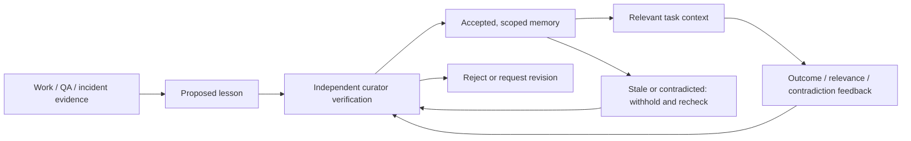

# Development team: feedback, learning and project context

Status: **design proposal**, 2026-09-21. This document does not activate a
scheduler, promote memories, change authority or claim full unattended delivery.
See [project context](../START-HERE.md), [architecture](../ARCHITECTURE.md) and
the [charter](../CHARTER.md) for the existing system and scope.

## User outcomes

An operator states a project goal and can see progress without repeatedly asking
for status. Agents start from a consistent scope, design and code map, carry a
bounded task through implementation/review, surface actionable exceptions and
reuse verified learning. A successor can take over without the previous chat.

The project home should answer: what outcome is pursued, what is moving, what is
blocked, who acts next, what decision is needed, and which build is running.
Visibility must distinguish planned, implemented, tested, merged, deployed and
operationally verified behavior.

## Feedback defaults

| Trigger | Routing and proposed behavior |
|---|---|
| Assignment and claim | Persist receipt/owner promptly. A missing claim becomes visible after about one minute; an enqueue is not execution. |
| Health | Cheap runtime lease/heartbeat checks every 30–60 seconds; no model call. Distinguish liveness from useful progress. |
| Milestone or meaningful progress | Worker updates task evidence immediately at a stage change; for long work, about every 10–15 minutes if there is something new. |
| Known blocker | Immediate event to the responsible owner, visible to PM: quota, approval, dependency, identity ambiguity or exhausted bounded recovery. |
| Review, merge or incident | Compact retro: cause, evidence, unsuccessful approach, correction and a lesson candidate only if reusable. |
| Curator | Event-triggered for serious hazards; otherwise daily batches only when proposals exist. |
| PM / research | Weekly asynchronous flow review and one bounded improvement experiment; additional research when recurring failures or external contract changes justify it. |

Intervals are tunable starting defaults, not universal research findings or a
promise that these timers already run. Suppress unchanged updates and deduplicate
alerts by task/revision/cause. Resolve an alert after verified recovery. Unknown
execution outcomes are reconciled before retry, not blindly repeated.

Workers send evidence to the role that can act: implementation to QA, QA findings
back to the author, verified delivery to Ops. PM sees exceptions, priorities and
summaries. Peer discussions are task-scoped and end in a decision or artifact;
there is no always-on all-agent discussion loop.

## Project documentation contract

Every registered project should reference a small context manifest containing:

- goals, supported use cases, non-goals and success criteria;
- architecture, module/folder map and integration/data boundaries;
- product/UX specs including error, empty, blocked and recovery states;
- ADRs with rationale, alternatives and supersession links;
- development, validation, release and recovery instructions;
- roadmap, current acceptance and source/deployed version evidence;
- accepted project memory and its verification queue.

Prefer links to existing reviewed documents instead of duplicate summaries that
can disagree. Each spec identifies its owner, status, source/review revision,
acceptance, affected paths and dependencies. Do not copy live queue/quota state
into a permanent design page. Scope changes update the spec and linked task;
structural changes update the map in the same PR.

A future task-start context bundle selects the relevant documents, accepted
lessons and current task evidence for the consuming role. A PM gets goal and
dependency context; a developer gets acceptance and affected modules; QA gets the
exact diff and regression risks; Ops gets rollout/authority evidence. The bundle
is bounded, revision-labelled and explains why each item was selected.

## Verified memory lifecycle

Keep operational state, source evidence and reusable learning separate. Queues,
current jobs, provider quota and resource ownership belong in runtime state with
freshness. Designs, research, test results and retros remain full artifacts.
Reusable memories are compact, git-versioned project facts linking to evidence.

The lifecycle is:

A proposal records one claim, rationale, application, limits, source
issue/PR/commit/test, author, date and project/component/path/provider scope.
Acceptance additionally records authenticated independent reviewer identity,
verification method/evidence, applicable versions and invalidation conditions.
Do not equate confidence, lint success or a new timestamp with factual truth.
The proposer cannot approve their own lesson; a memory cannot grant permissions
or replace the user's objective. These stronger record-level guarantees remain
implementation work.

At dispatch/resume or a meaningful task-scope change, supply only relevant,
accepted and valid lessons. Begin with a few matches under the existing bounded
prompt budget; allow explicit lookup for full evidence. General job/coordinator
and issue dispatch paths need equivalent behavior. Use planned paths/component
metadata before any commit exists; use changed paths for review.

Consumers report useful, irrelevant or contradicted memory IDs with evidence.
Contradictions and relevant source/version changes trigger withholding and
revalidation; retain history and supersession. Project decisions persist with
their ADRs, while temporary environment observations expire or move to runtime
state. Cross-project reuse is a separate explicit promotion, never implicit
retrieval from another project.

A daily curator batch should deduplicate candidates and prioritize repeated
failure modes. QA contributes what it caught; developers contribute failed and
successful approaches; Ops contributes ownership/recovery lessons; research
contributes verified findings with scope. The system learns through reviewed
artifacts and improved tooling/evals, not through model-weight training.

## Graph and UX

A Graphify-style index is useful after the documentation sources are clear.
Nodes can represent project goals, capabilities, specs/ADRs, modules, tests,
issues/PRs and memories. Edges such as implements, verifies, depends-on,
contradicts and supersedes must retain source location/revision and whether they
were extracted or inferred. Inferred edges never establish approval or authority.

Build incrementally from changed files and affected relationships; invalidate
removed/stale edges. Exclude secrets, runtime databases, raw provider transcripts,
build caches, dependencies and unrelated projects. Keep private evidence private
when linking a public repository map. Semantic indexing has a measured budget;
start with deterministic links/imports and a small docs corpus. The graph is
rebuildable derived data, not the source of truth and not a requirement for
reading the start page. No generated graph is shipped by this proposal.

The UI should expose:

- a Start here view with scope/design/code map and current-version evidence;
- role/model/effort desired versus running, task stage, last useful progress,
  quota freshness, blocker and next action on each agent;
- accountable inbox stages and a consumer, not simply unread counts;
- one evolving alert per unresolved cause, with source evidence and recovery;
- Proposed / Accepted / Needs recheck / Rejected or Superseded memory views,
  including why a lesson was retrieved or withheld;
- clear differences between no data, proposals awaiting review, no applicable
  lesson, load failure and stale deployed UI.

## Sequencing and acceptance

First close the unattended local loop: coordinator admission/alert correctness,
real provider-bound quota, active-turn recovery, accountable inbox consumption,
independent review/merge evidence and one verified rollout. In parallel, implement
trusted curator identity/evidence, lifecycle and retrieval parity. Then improve
goal-to-plan acceptance and UI/context bundles. Add cloud adapters and richer
graph/wiki views only after the common lifecycle and isolation contract is proven.

Use existing ticket groups: CAD176/114/227 for runtime coordination;
CAD226/212/120/123/124/217 for handoff and authority; CAD187/111/191–195/203
for learning; CAD159/160/163/224 for goal/acceptance; CAD223/85/86/87 for UX;
CAD65/66/67 for knowledge views; CAD173/129/228 for test and CI efficiency.
Reconcile these ticket labels against merged evidence before redispatching.

The acceptance scenario is a bounded project that reaches an authorized reviewed
merge, handles a provider/quota failure and restart without duplicate work,
emits one actionable escalation, and independently verifies a lesson reused by
a different worker on a later task. Add these outcomes to CAD225's existing
harness; deleting its unsupported labels is not implementation.

Research experiments compare the current approach with a few alternatives on
representative tasks, including failure/restart cases. Record correctness,
operator interventions, latency, cost and limitations, and preserve a holdout set.
Track review/CI wait, lead time, rework, failure recovery and cost per accepted
task alongside memory relevance and recurring defects. Busy agents, message
volume and number of saved lessons are not success metrics.

External guidance supporting this design (not its proposed timer values):
[composable agent workflows](https://www.anthropic.com/engineering/building-effective-agents),
[outcome-based agent evals](https://www.anthropic.com/engineering/demystifying-evals-for-ai-agents),
and [delivery throughput plus instability](https://dora.dev/guides/dora-metrics/).
