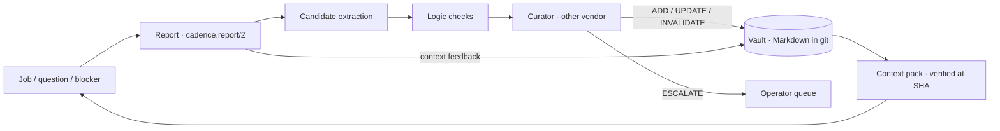

# Learning loop: reports, verification, vault and context packs

Date: 2026-09-23. Status: **proposed** design record. Operator direction:
memory policy approved 2026-09-23 (decision #2); the identity and trust proposal
(decision #3) confirmed 2026-09-23. Builds on the existing memory store
(`src/memory/`), `cadence report`, `cadence issue retro` and
[DEVELOPMENT-TEAM.md](DEVELOPMENT-TEAM.md). Evidence:
[research record](../../design-plans/20260923-onboarding-master-agent/RESEARCH.md).
Tickets: CAD-341, CAD-346–CAD-357, CAD-381, CAD-382, CAD-260.

## Problem

Agents re-read and re-check what the team already knows, and nothing learned in
one task reaches the next. The store exists but no lesson has ever been accepted:
all 11 are `proposed`, blocked because memory identity requires a live PTY
endpoint while every team agent that proposes or reviews is a managed endpoint
(CAD-260). Reflections exist only as hand-posted comments; lessons reach only
`issue dispatch` (not `--job`), and stale lessons are not withheld.

## Flow



## 1. Reports (CAD-341)

Every finished job, question or blocker files a Markdown report in
`projects/<slug>/tickets/<ID>/reports/<date>-<session>.md` (the agent's
`journal/INDEX.md` links it) with frontmatter:

```markdown
---
kind: done            # done | question | blocked
task: RMD-1
agent: dev
session: dev#1
sha: 3f9c2e1…
constraints: ["copied verbatim from the kickoff"]
context_feedback:
  used: [{id: L-12, helpful: true}]
  wrong: [{id: L-7, why: "wrangler 4 renamed the flag"}]
  reread: [src/index.ts]
---
## Expected
## Evidence
## Cause
## Correction
## Lesson
- type: pitfall · scope: role:dev path:wrangler.toml · confidence: medium
  Cron triggers for Workers belong in `wrangler.toml [triggers]`.
  Evidence: `wrangler.toml:12@3f9c2e1`, test `scheduled.spec.ts`
## Next
```

The six headings are the existing reflection fields (cadence skill). Questions
add `state: input-required`, options and impact, and climb worker → PM → master →
operator, checking the vault first (CAD-342). A message from another agent never
counts as operator consent.

## 2. Verification

**Logic checks** (CAD-348) run first and never trust the reporter: resolve every
citation at HEAD, re-run cited tests in a build slot, secret scan, de-duplicate
against the same scope, detect contradictions, and tag content derived from
external data (web, CRM, inbox, issue text from outside the team).

**Curator** (CAD-349): an agent of a different vendor from the proposer returns
ADD, UPDATE (merge), INVALIDATE, NOOP or ESCALATE with a reason.

**Trust matrix** (decisions #2 and #3 approved) — acceptance depends on
*provenance × evidence*, not on identity ceremony alone:

| Provenance ↓ / Evidence → | Mechanical (re-runnable: tests, `file:line@SHA`) | Judgement (strategy, pitfall without a mechanical check) |
|---|---|---|
| Operator | accepted after logic checks | accepted |
| Agent · verified (daemon launch record) | logic checks + 1 curator of another vendor | curator; company scope adds a second reviewer of a third vendor or the operator |
| Agent · claimed (identity not provable) | logic checks + 1 curator of another vendor | operator |
| External-derived | quarantined — operator only | quarantined — operator only |

Company-scope items keep the two-review quorum of the current store.

## 3. Identity (decision #3, CAD-381)

- One identity rule for memory, reviews and reports: the daemon's own launch
  record (the CAD-230 enrollment: provider pid + start time + uid + owner
  generation), for **pty and managed endpoints alike**. No memory-specific
  `/proc` PTY rule; this also makes identity work on macOS.
- Callers outside every agent tree are "not an agent" — the operator path — and
  are never impersonated.
- The backlog (CAD-382): the 11 stuck proposals become *agent · claimed*
  candidates. Mechanical ones pass after re-run + curator; judgement ones go to
  the operator queue in the Vault UI (CAD-357) under web operator auth (CAD-313).
  First exit test: one existing proposal reaches `accepted` in a test.

## 4. The vault (CAD-346)

All Markdown with frontmatter in `~/pm` (the tracker repo, so it syncs with its
remote). One item per file; itemized delta updates only. Layout and the
per-agent files are in [AGENT-FILESYSTEM.md](AGENT-FILESYSTEM.md).

```markdown
---
id: L-12
type: pitfall          # fact | strategy | pitfall | procedure | faq
status: verified       # candidate | verified | needs-revalidation | invalidated
scope: {role: dev, paths: [wrangler.toml], project: reminders}
evidence: [{kind: commit, ref: 3f9c2e1}, {kind: test, ref: scheduled.spec.ts, rerun: pass}]
provenance: agent-verified   # operator | agent-verified | agent-claimed | external
proposer: dev#1 (codex)
curator: claude (sonnet)
valid_from: 3f9c2e1
invalidated_at: null
last_verified: 2026-09-23
expires_after_unused: 28d
helpful: 6
harmful: 0
supersedes: [L-7]
---
Cron triggers for Workers belong in `wrangler.toml [triggers]`; dashboard crons
are overwritten on deploy.
```

Project memory stays in `<pm>/<project>/memory/` and is indexed, not moved.
Agent notes move from `/var/www/agent-notes` into git (CAD-355).

## 5. Context packs (CAD-351)

Built at task start, same builder for issue dispatch, `--job` dispatch and
continuity:

1. Static first (byte-stable, caches): the agent's `SOUL.md` and `AGENT.md`
   body, the company handbook excerpt.
2. The contract: acceptance, constraints and non-goals verbatim.
3. The agent's `MEMORY.md` index, then lessons by path, similarity, agent; FAQ;
   skills by name only.
4. Re-check each lesson's citations against HEAD; withhold stale or contradicted
   items with the reason (CAD-203).
5. Rank by confidence × helpful rate × recency; cap to the agent's budget; render
   "verified at SHA" with the citation; log included ids for feedback.

## 6. Feedback, consolidation and measurement

- Reports mark items used, helpful or wrong; harmful > helpful demotes; unused
  for 28 days expires (validated use resets the timer).
- Nightly consolidation (CAD-352) produces a reviewed vault diff — merge
  duplicates, invalidate stale items, draft skills; never an in-place rewrite.
- Skills are promoted only after an A/B shows benefit (CAD-353).
- Metrics (CAD-354): reuse, helpful and harm rates, stale rate, reads avoided,
  tokens and time, merges without rework, reviewer precision on seeded bugs,
  and a planted poisoned item that must be rejected or withheld.

## Acceptance (milestone M3)

A lesson from one worker's report is verified by a curator of another vendor and
reused by a different worker with measured savings; a stale item is withheld; a
planted poisoned item is rejected; one of the 11 existing proposals is accepted.
